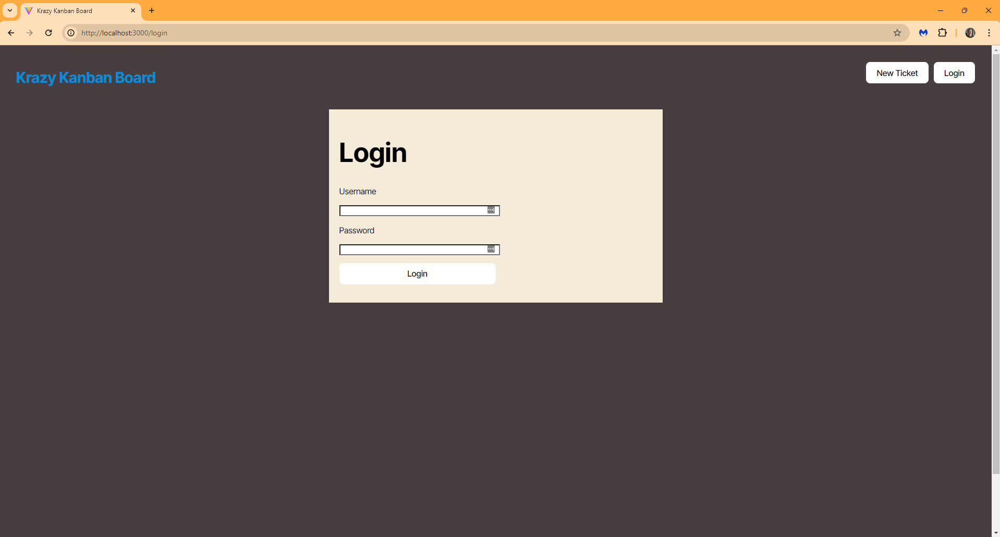

# Krazy Kanban Board

A full-stack Kanban board application with secure authentication using JSON Web Tokens (JWT). Users can log in, view, create, edit, and delete tickets, with all API requests protected by JWT authentication.

## Features

- User authentication with JWT (login/logout)
- Secure API endpoints for tickets and users
- Kanban board UI with columns for Todo, In Progress, and Done
- Create, edit, and delete tickets
- Assign tickets to users
- Responsive and modern UI

## Screenshots





## Getting Started

### Prerequisites

- Node.js (v18+ recommended)
- PostgreSQL

### Installation

1. **Clone the repository:**
   ```sh
   git clone <your-repo-url>
   cd kanban
   ```

2. **Install dependencies:**
   ```sh
   npm run install
   ```

3. **Set up the database:**
   - Create a PostgreSQL database named `kanban_db` (or update the name in `.env`).
   - Run the schema:
     ```sh
     psql -U <your_db_user> -f server/db/schema.sql
     ```

4. **Configure environment variables:**
   - Copy `.env` example and fill in your credentials in `server/.env`:
     ```
     DB_NAME='kanban_db'
     DB_USER='your_db_user'
     DB_PASSWORD='your_db_password'
     JWT_SECRET_KEY='your_super_secret_key'
     ```
     
### Running the App

- **Development mode**
  ```sh
  npm run dev
  ```

- **Production build:**
  ```sh
  npm run build
  npm start
  ```

- The client runs on [http://localhost:3000](http://localhost:3000) and the server on [http://localhost:3001](http://localhost:3001).

## Usage

- Visit `/login` to log in with a seeded user (e.g., `RadiantComet` / `password`).
- After login, you can access the Kanban board, create, edit, and delete tickets.
- Log out to invalidate your session.

## API

- All `/api/*` endpoints require a valid JWT in the `Authorization` header.
- See [Assets/Insomnia_M14_Challenge.json](Assets/Insomnia_M14_Challenge.json) for example API requests.

## Deployment

- The app is ready for deployment on Render or similar platforms.
- Set environment variables in your deployment environment as in `.env`.

## License

MIT License

---

© 2025 Eldrish-Ramos
